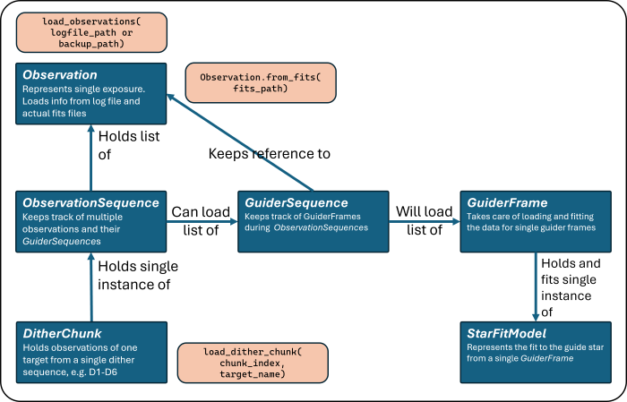

# VIRUS-W Explorer

Simple tool to review VIRUS-W observations on-the-fly at the Harlan-J-Smith telescope at McDonald Observatory.

## Table of Contents
- [Requirements and Installation](#requirements-and-installation)
- [Setup](#setup)
- [Shortcuts](#shortcuts)
- [Example Usage](#example-usage)
- [Data Model Structure](#data-models)

## Requirements and installation

Since the linux machine operating VIRUS-W runs on a specific python-3.6 version, the script should be backwards-compatible but may also work with newer Python versions.

You can install it in your current python environment using 
```bash
git clone https://github.com/FBalzerMPE/vw_explorer.git
cd vw_explorer
pip install .
```
If you plan on editing the code on your machine, instead use
```bash
pip install -e .
```
⚠️ Also, it might be advisable to use a dedicated `venv` or `conda` virtual environment with python 3.6 for this, as the project relies on outdated `matplotlib|astropy|scipy` packages in order to work on the linux machine at HJS.

This installation allows you to use `import vw_explorer as vwe` in your scripts and notebooks whenever the environment you've installed it in is active.

### Setup

Upon importing the package for the first time, the program will ask you for confirmation to generate a config file at `~/.vw_explorer/config.yml` in your home directory.

After allowing it to do so, modify it such that the paths specified there point to your data:
- data_dir: The directory where your log file is expected to be in.
- observation_dir: The directory with the observations. They may be in subdirectories (e.g. one for each day)
- guider_dir: The directory with the guider frames. Should only contain these! May contain subdirectories.
- ouput_dir: The directory where plots and processed files will be saved.

Alternatively, you can use the default config that is copied initially, and create a `data` working directory within the same directory you have cloned `vw_explorer` into.

### Shortcuts

Upon installation via `pip install`, two shortcuts will be added to your command line (whenever you are in the python env you installed it in):

- **`vw_quicklook`** allows you to take a quick look at the IFU data from a VIRUS-W observation file (which are assumed to have a filename following the `vwXXXXXX.fits` pattern). Run `vw_quicklook -h` in your terminal for more information.\
  This program will open a window displaying a collapsed IFU image for each file specified.
- **`vw_process_guideframes`** allows you to process the observation log file into csv format, split the observations into dither chunks, and analyze the corresponding guider frames by fitting 2D Gaussians to the regions around the fiducial coordinates specified in the log. Run `vw_process_guideframes -h` in your terminal for more information.\
  The processed csv files and plots are saved in the `ouput` directory specified within the 

⚠️ In order to process the log file, it is important that it follows the expected format. If you are unsure how that should look like, see `vw_explorer/example_data/log.txt` for an example with some further explanation.

## Example usage

Please see the example Jupyter notebook at `vw_explorer/example_usage.ipynb` which showcases a typical workflow for more information.

## Data models

The following image shows the structure of classes within this module. The beige boxes denote typical constructors for lists of observations or a dither chunk.



## License
This project is licensed under the MIT License. See the [LICENSE](LICENSE) file for details.